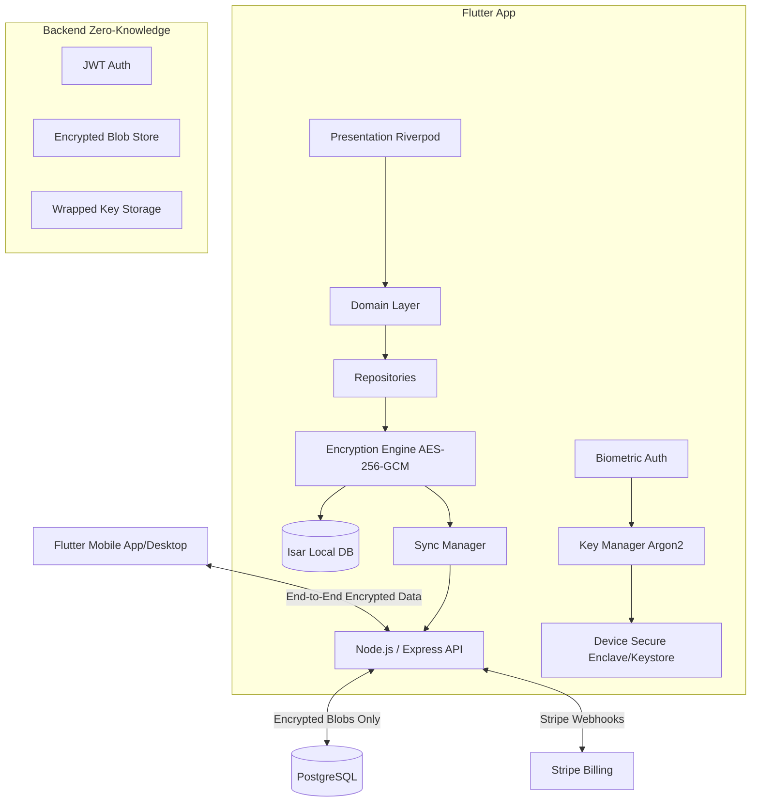

# Project Aegis Architecture Diagram

## High-Level System Architecture

## Security Flow
1. User creates account with Password.
2. App derives `MasterKey` via Argon2 using Password + Salt.
3. `MasterKey` generates a random `SyncKey` and `LocalKey`.
4. `LocalKey` encrypts Isar database and is stored in Secure Enclave, unlocked via Biometrics.
5. Notes are encrypted individually with AES-256-GCM using unique IVs.
6. For Cloud Sync: `SyncKey` is encrypted by `MasterKey`, and sent to server as `WrappedSyncKey`.
7. Encrypted notes are uploaded. Server never sees `SyncKey` or `MasterKey`.
